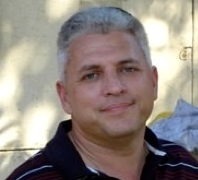

### Alex Liberzon
<html>  </html>
Associate Professor 
>> [Turbulence Structure Laboratory](http://www.eng.tau.ac.il/turbulencelab)

Wolfson Building, office 316 	
School of Mechanical Engineering 
Faculty of Engineering 
Tel Aviv University 
Tel: +972-(0)3-640-8928 
Lab: +972-(0)3-640-6860 
E-mail: [alexlib@eng.tau.ac.il](mailto:alexlib@eng.tau.ac.il)

#### Open Source Software
* [Open Source Particle Image Velocimetry](http://www.openpiv.net)
* [Open Source Particle Tracking Velocimetry](http://www.openptv.net)
* [Tel Aviv Ph.D. or M.Sc. Thesis Template for LyX (www.lyx.org) or LaTeX (www.latex.org)](http://github.com/alexlib/)

* [Personal blog](http://alexl.wordpress.com)